# Assignment 2 Writeup

This assignment add _Feature Detection_ via *Hessian*, as
well as _Two Line Detectors_ via *RANSAC* and *Hough Transform*.

The algorithms will be briefly explained in each section, as well
as a summary of the results.


## Images

The results of this assignment use mainly the Road.  
  
Road  
  

Kangaroo  
  
  
Red  
    
  
Plane  
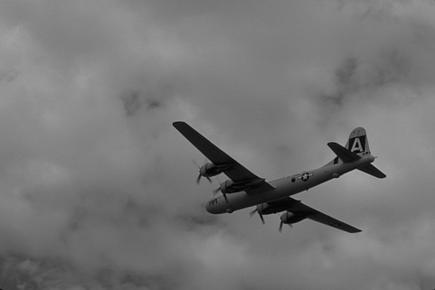  

  
## Hessian Feature Detection

### Algorithm Overview
Calculated the second moment matrix and determinant for each point in the image,
using the formulas: 
```
Hessian(I) = [Ixx Ixy] 
             [Ixy Iyy] 
             
Determinant(I) = Ixx * Iyy - Ixy ^ 2
```

Then threshold the determinants, casting aside everything that doesn't pass.

Finally, apply non-max suppression in 3x3 neighborhoods.

**Gradient Examples:**  

Road Ix:  
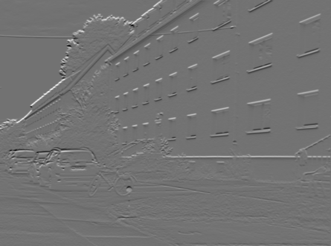  

Road Ixy:  
  

Road Iyy:  
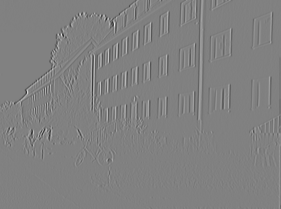  

### Results
Low threshold: 1000  
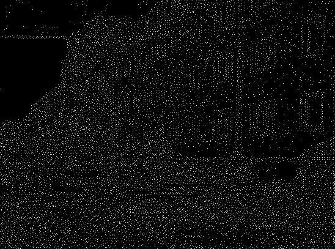  

Medium threshold: 31000  
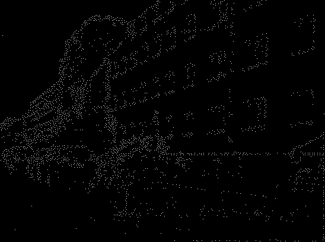  

High threshold: 51000  
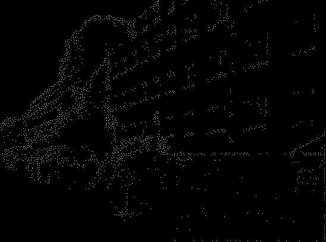  

Very High threshold: 71000  
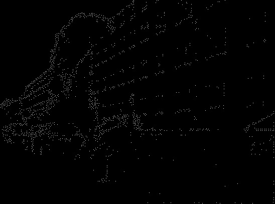  

Extremely High threshold: 91000   
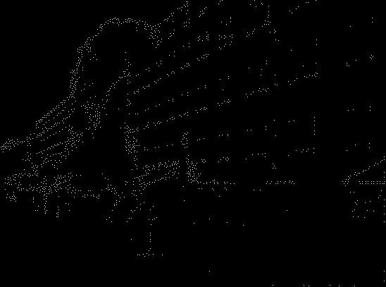  

Even More Extremely High threshold: 111000   
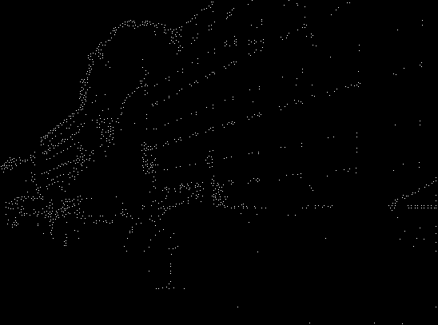

Absurdly High threshold: 151000  
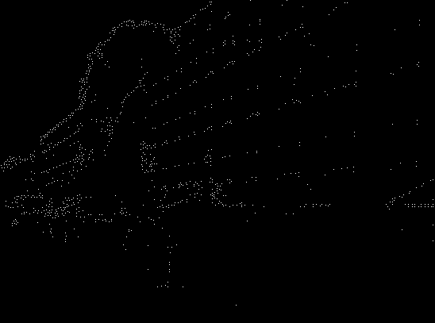

### Analysis
The absurdly high thresholds tend to produce better features that are less likely to have
 mass amounts of outliers.  
The low threshold is completely crowded. As the threshold is increased, the shape and features of the 
image become much more apparent.

## RANSAC Line Detection

### Algorithm Overview

First, process the image for feature points.  
Then choose a small subset, in this case: 2, points uniformly at random.  
Then fit a linear model to that subset and find 'inlier points', or points that are within a
	thresholded distance from the model.
Next, if there are more than a certain number of inliers, record the line and refit a model
 	using the new inliers.
Reject the rest of the points as outliers.
Choose the best line based the total error.  
Repeat, then plot the lines.

**Parameter choosing:**  
* inlier threshold: sqrt(3.84 * gaus_sig ^ 2) for Zero-mean Gaussian noise
* num sample runs : N = log (1 - p) / log (1 - (1 - e)) where:
	* p is the probability that at least one random sample is outlier free
	* e is the outlier ratio

### Results
Low minimum inlier threshold: 2  
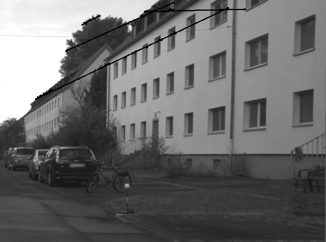

Medium minimum inlier threshold: 7  


High minimum inlier threshold: 15  


### Analysis

The main problem are the gaps in the lines caused by parallel lines in the image. Many of 
windows frames in the `road.png` photo are collinear, causing the inlier calculation to extend
 the line's bounds past where the singular window stops.  

ex:  thresh 71000  
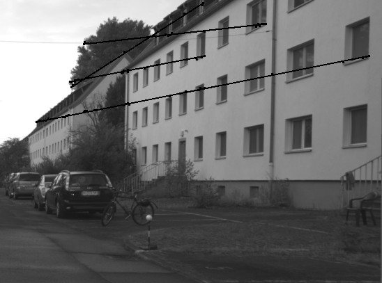  

Here, the algorithm correctly identifies many of the common lines in the image, but links them
together in ways that distort the true line. 

This could be remedied with a clipping function that only allows so much space between inliers,
or one that casts away points that are dissimilar from the rest of the line. 

**Minimum Inlier Threshold:**  
Though there are the parallel problems, raising the number of inliers to be considered a 'line' seems 
to help the algorithm choose only the lines that are closest together. As we get higher, we risk 
make it so no line will be able to qualify as a good line, and face missing small lines entirely as well.


## Hough Transform Line Detection

### Algorithm Overview

First, discretize parameter space into bins for vote accumulation.  
Then, process the image for feature points.  
For each feature point, cast a vote into every bin that could have generated this point.
After, find the bins that have the most votes.  

For drawing the lines, I have opted to simply record which feature points vote where, and then 
plot all feature points that cast a vote in the highest bins, as per Professor's recommendation.  

### Results

Feature Threshold: 1000  
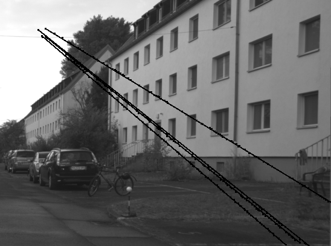

Feature threshold: 51000  


Feature threshold: 71000  
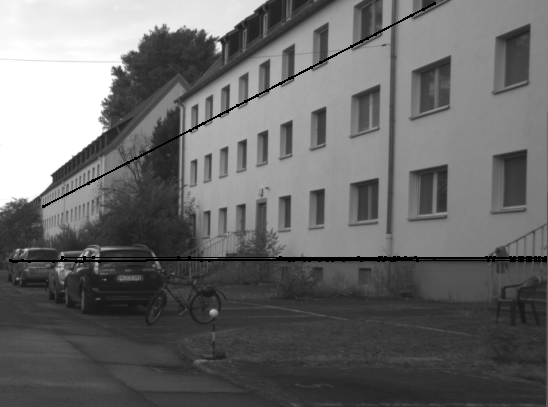

### Analysis
The 51000 Threshold is an incredible example of the parallel line detection.  
Hough Parameter space is able to caputre all points that could possible create the line,
so almost all points of parallel lines can be captured.  

When there are too many feature points, as in the 1000 Threshold image, the algorithm casts too many
votes and the clustered points are given too much credibility.    

When features are thresholded too high, the algorithm finds too many similar lines around the same edge.

## Overall Remarks

Hessian detecting is an easy, general purpose feature detection.  

RANSAC works well when the parameters are adjusted right, but also is random, which makes results difficult
to decipher.

Hough Transform is more dependable, but falls into the parallel line trap, where edges are extended over 
gaps where they should not be. 

