# Assignment 3 Writeup

This assignment add _Segmentation_ via *K-Means* and *SLIC* algorithms.

The algorithms will be briefly explained in each section, as well
as a summary of the results.

## Images

The results of this assignment use the `wt_slic.png` and `white-tower.png` images.  
  
Wt Slic  
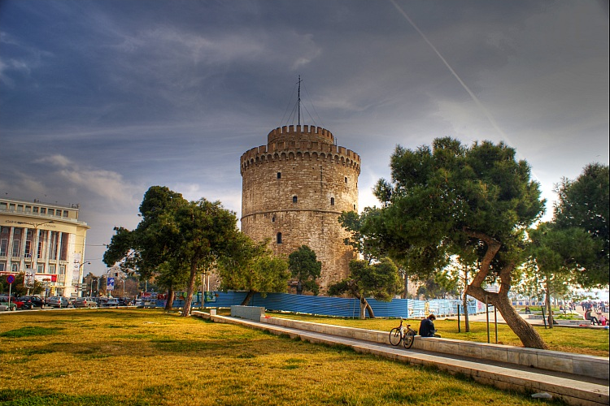  

White Tower  
  

## K-Means

### Algorithm Overview

1. Sample `k` points in the original image to use as seed cluster centers.  
2. For each point in the image, find closest cluster by RGB distance and associate them.  
3. For each cluster, recenter around the mean RGB value of all of it's points.  
4. If any of the centers have changed, loop back to step 2.  
5. Once all clusters are centered and points are in their closest cluster, 
overlay the image with the clusters as their mean RGB value.

### Results

2 Clusters (k = 2):  
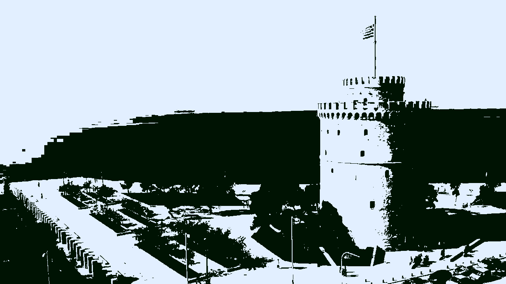  

4 Clusters (k = 4):  
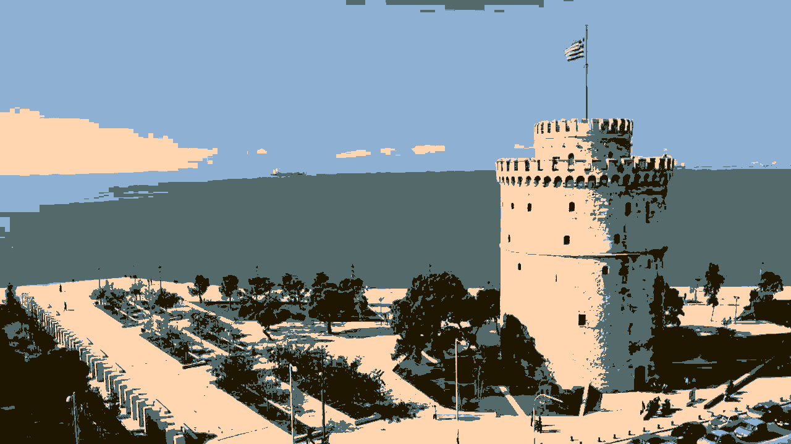  

10 Clusters (k = 10):  
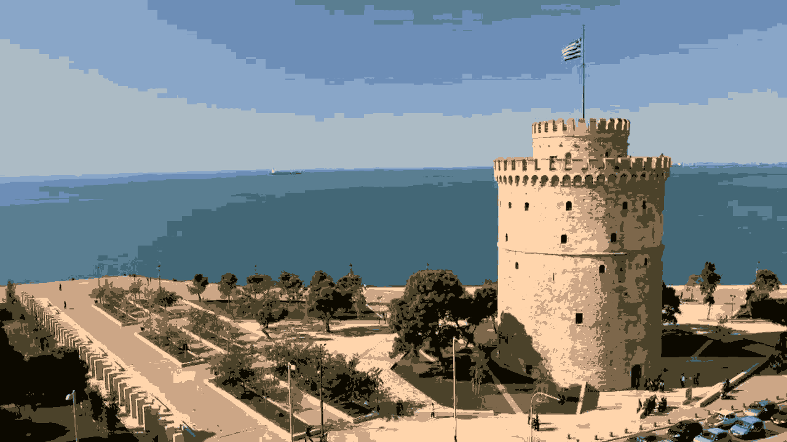  

### Analysis

The speed of the algorithm slows noticeably with more clusters, though even just two clusters
takes a few minutes. With fewer clusters, there are fewer distance operations that have to be
performed for each point.

The process used around 110 MB while processing an image of just 615 KB. With 10 clusters, the process took 1757.82 seconds.
Optimizations can definitely be made here.

## SLIC

### Algorithm Overview
1. Divide the image into clusters of n x m (in our case n=50, m=50) pixels, initially choosing the cluster centroid as the center of the region. 
	1. Move the cluster centroids to the position with the smallest gradient in a 3 x 3 pixel window from the 
	initial centroid point.
2. Use k-means in the 5D space of x/2, y/2, R, G, B to center points around their closest cluster. The maximum distance
x, y distance to be compared is twice the cluster size. 
3. Once all clusters have converged, color the pixels with the average of their cluster, and all border pixels black.

### Results

The SLIC was much more challenging to implement. My first few attempts resulted in images like:  

#### Failures  
50 x 50 clusters  
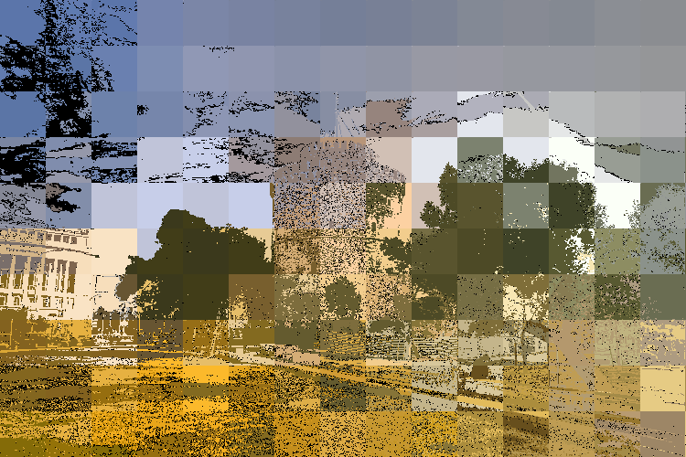  

100 x 100 clusters  
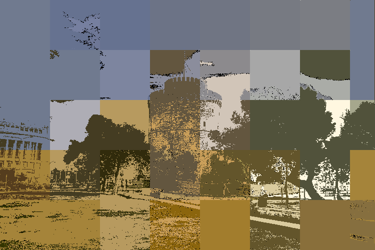  

#### Successes  
I found that reading the research paper was instrumentally helpful to implementing the algorithm. All my struggles were 
solved after a thorough reading.  

50 x 50 Clusters with borders  
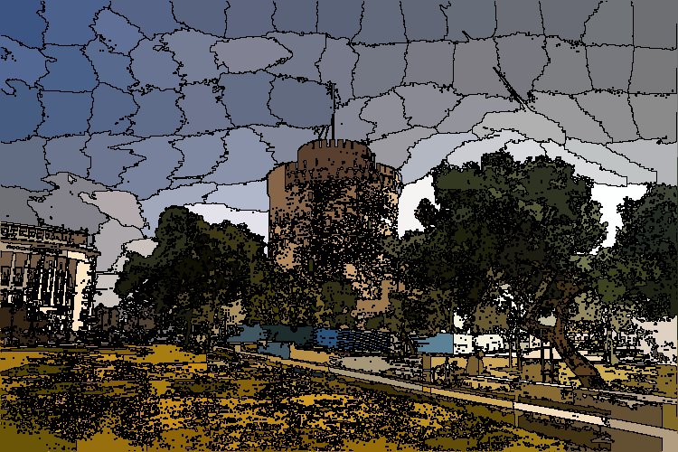  

50 x 50 Clusters without borders  
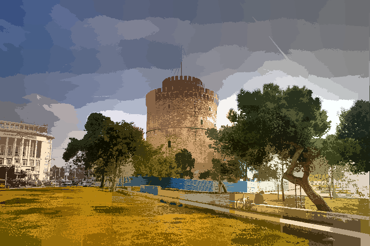  
Here you can see the dense areas are truly scattered with *orphan pixels*.  

100 x 100 Clusters with borders and higher error tolerance  
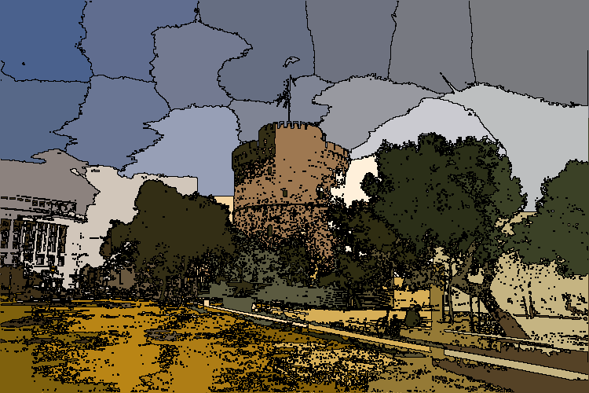  

25 x 25 Cluster with border of the K-means Sample Photo  
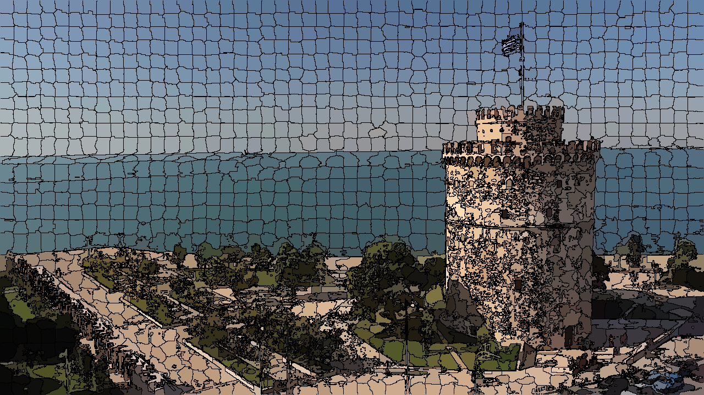  

### Analysis + Notes

For processing the same image as kmeans, the memory usage was up to 209 MB. The process took 318.84 seconds, 
which is 1438.98 seconds faster than a similar kmeans segmentation. The number of loops taken to center all of the 
points around their closest clusters was also dramatically less than Kmeans. In this example, only 3 recentering loops 
were needed.  

The SLIC algorithm makes short work of image segmentation, especially compared to K-means. The major downfall is the tight
areas that become over-segmented. This could be solved by implementing cluster connecting. 

For further development, I would implement clusters that enforce cluster connectivity. The paper specifically states
that *some “orphaned” pixels that do not belong to the same connected component as their cluster center may remain.* We
are not too worried about these at this point. 

### Extra Fun Stuff

Here is a photo processed first with Kmeans, then with SLIC:  
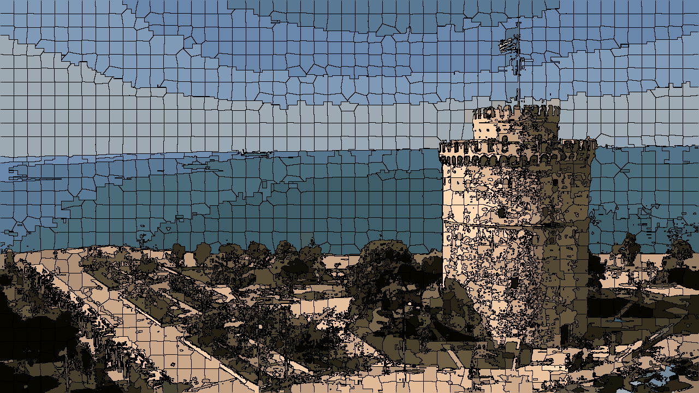  

And here is the other way around:  
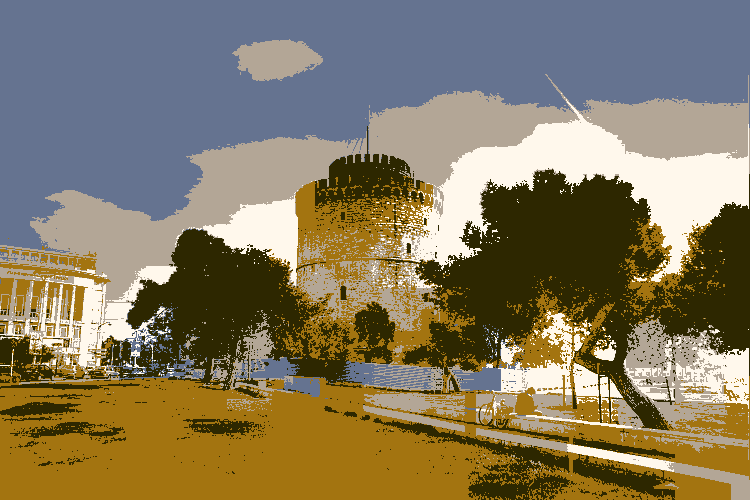  

They actually don't look too far off from their single-processed counterparts. Interesting.  
